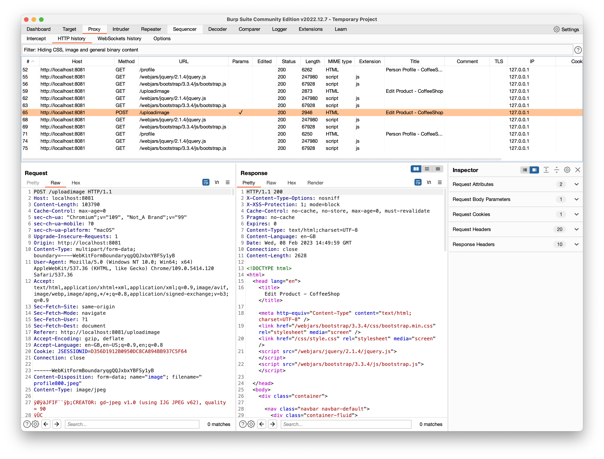

# Hint 2

Use a tool like [Burp Suite Community Edition](https://portswigger.net/burp/releases/professional-community-2022-12-7?requestededition=community&requestedplatform=) to intercept the http call and figure out how this works.

__Pro tip__: use the proxy and check the HTTP history when uploading or use the interceptor

