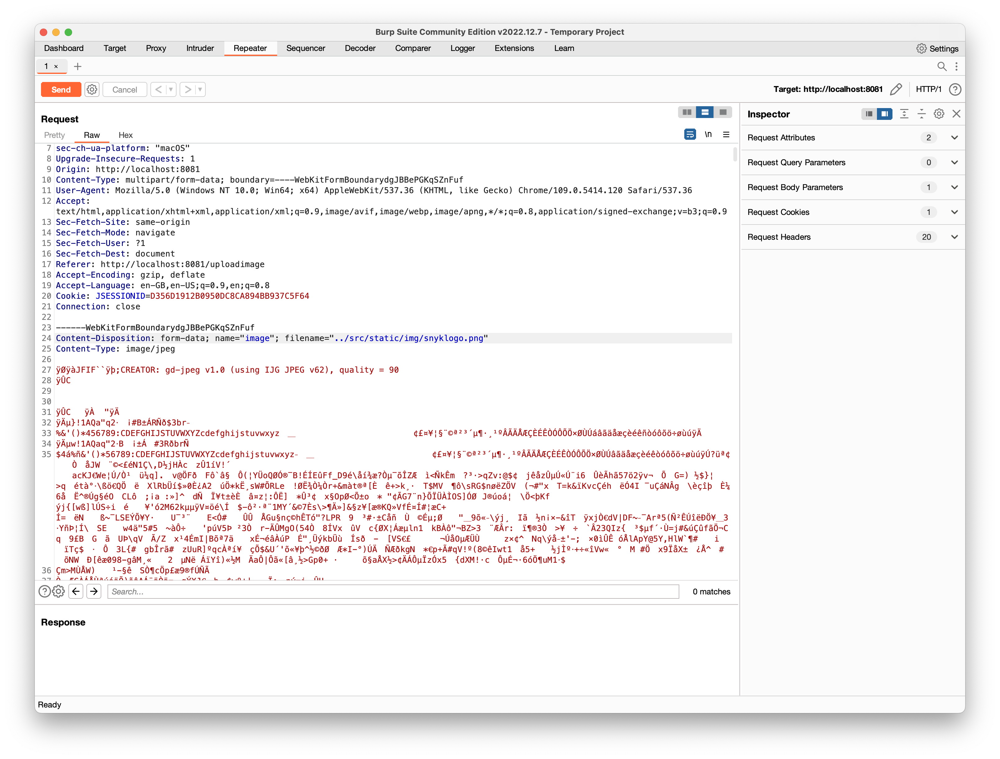

# Hint 4
Load the previous upload HTTP request into the repeater and change the filename to
```
../src/static/img/snyklogo.png
```

When you reboot the application, your image should be visible in the header.

