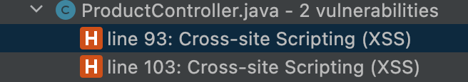

# Solution Fix for FREELOADER Assignment

The `ProductController` contains 2 XSS vulnerabilities.
- A reflective XSS problem on line 93.
- A stored XSS problem on line 103

The Snyk IntelliJ plugin can highlight them for you



A possible solution is to sanitize the input use `StringEscapeUtils` that is part of the Apache Commons Text library.
There several other solutions as well to do sanitization.

In your pom file add

```xml
<dependency>
    <groupId>org.apache.commons</groupId>
    <artifactId>commons-text</artifactId>
    <version>1.10.0</version>
</dependency>
```

Now rewrite the lines 93 and 103
- `writer.write("<div class=\"panel-heading\"><h1>"+ StringEscapeUtils.escapeHtml4(param) + "</h1></div>");`
- ```java         
  writer.write(String.format(output,
                StringEscapeUtils.escapeHtml4(prod.getDescription()),
                StringEscapeUtils.escapeHtml4(prod.getProductType()),
                StringEscapeUtils.escapeHtml4(prod.getPrice())));
  ```

## Secondary fixes

This hack combines a few problems. Other mitigation meassures you should take
- Set a password to the database (via the `application.properties`)
- Disable the h2-console (via the `application.properties`) or make h2-console unavailable (`SecurityConfig`)
- Set Session cookie to http-only (via the `application.properties`)
