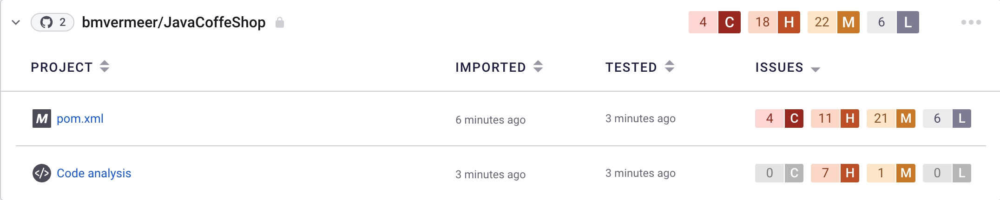
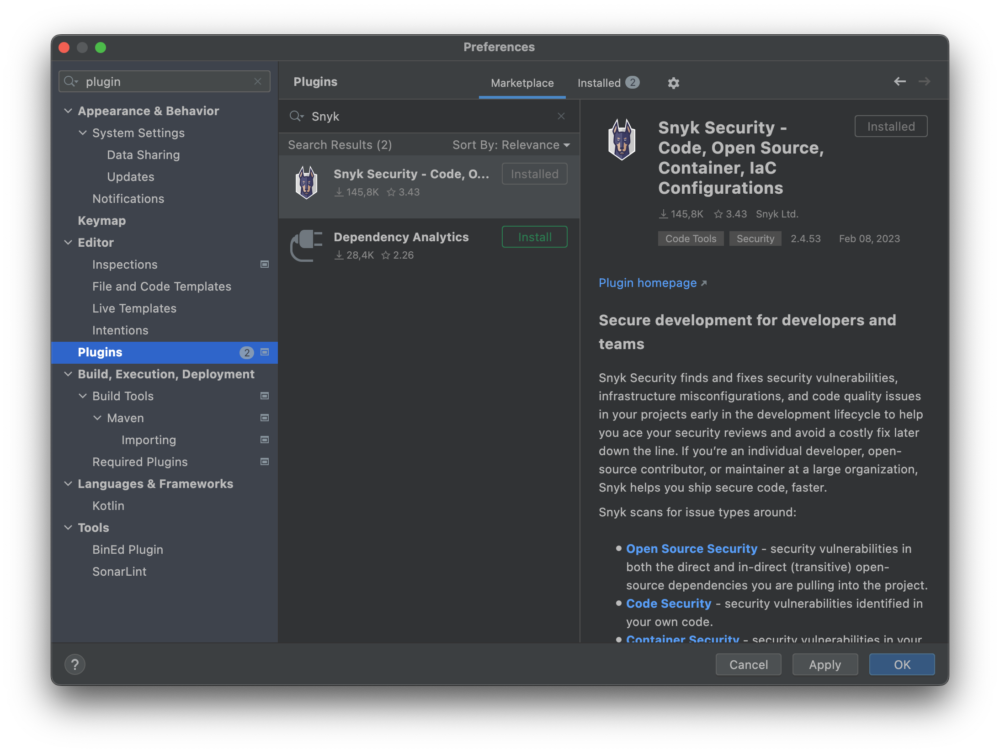
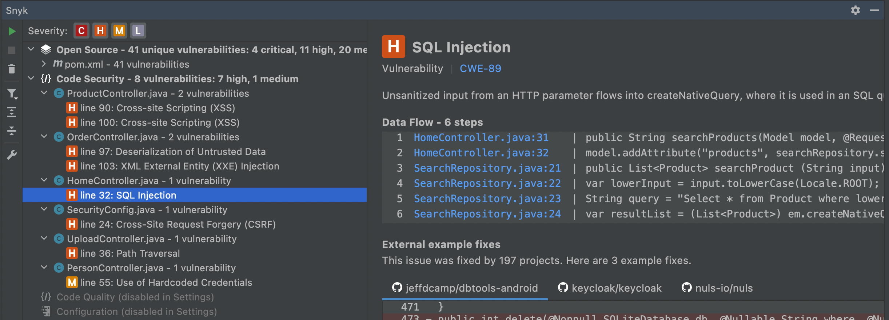

# Snyk tools

After you sign up for Snyk there are different tools available to help you during development.

Snyk has a couple of products that you can use for free

- [Snyk Code (Code analysis or SAST)](https://docs.snyk.io/scan-application-code/snyk-code)
- [Snyk Open-Source (Dependencies analysis or SCA)](https://docs.snyk.io/scan-application-code/snyk-open-source)
- [Snyk Container (Container analysis)](https://docs.snyk.io/scan-application-code)
- [Snyk IAC (Infrastructure as Code analysis)](https://docs.snyk.io/scan-cloud-deployment/snyk-infrastructure-as-code)


These products can be leveraged using different tools, so you can integrate it in your workflow as you desire.

---
# Snyk Github Integration (Web UI) 

After signing in to your Snyk account at https://app.snyk.io you can add your GitHub project for scanning.
When your project is imported you will find it in you overview with the scan results like the example below.




Browse around to find security vulnerabilities in the different segments of your application.

[Documentation](https://docs.snyk.io/integrations/git-repository-scm-integrations/github-integration) about the GitHub integration.

---
# Snyk CLI

Snyk CLI brings functionality of Snyk into your development workflow. You can run the CLI locally, or in your CI/CD pipeline to scan your projects for security issues, including security vulnerabilities and license issues.

## Install

You can install the CLI on your local machine in different ways

#### [npm](https://docs.snyk.io/snyk-cli/install-the-snyk-cli#install-the-snyk-cli-with-npm-or-yarn)

```npm install snyk -g```

#### [Homebrew](https://docs.snyk.io/snyk-cli/install-the-snyk-cli#install-with-homebrew-macos-linux)
```
brew tap snyk/tap
brew install snyk
```

#### [Scoop (for windows)](https://docs.snyk.io/snyk-cli/install-the-snyk-cli#install-with-scoop-windows)
```sql
scoop bucket add snyk https://github.com/snyk/scoop-snyk
scoop install snyk
```
#### [Download the binary](https://docs.snyk.io/snyk-cli/install-the-snyk-cli#install-with-standalone-executables)
#### [Other options](https://docs.snyk.io/snyk-cli/install-the-snyk-cli)

## Authenticate

After installing the CLI, you need to authenticate the CLI by running:
```
snyk auth
```

## Scan 
You can scan locally on your system 

Code Analyses - `snyk code test`
Dependencies - `snyk test`
Container - `snyk container test`

There are many more commands. Check the [summary](https://docs.snyk.io/snyk-cli/cli-reference) for more information

---
# IDE integrations

For many IDE's there are plugins available to do the scanning inside you IDE.

Like :
- [Eclipse](https://docs.snyk.io/ide-tools/eclipse-plugin)
- [IntelliJ IDEA](https://docs.snyk.io/ide-tools/jetbrains-plugins)
- [VS Code](https://docs.snyk.io/ide-tools/visual-studio-code-extension)
- [more ...](https://docs.snyk.io/ide-tools)

Check the marketplace for your specific IDE if you want to install it.

### Jetbrains IntelliJ IDEA

